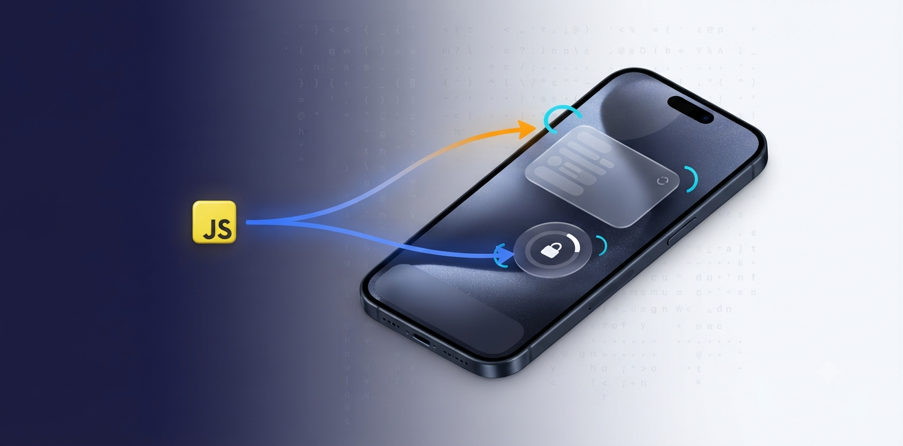

# expo-widgetkit-bridge


<p align="center">
  
</p>

<h3>A tiny bridge from <a href="https://reactnative.dev/">React Native</a> / <a href="https://expo.dev/">Expo</a> to Apple's <a href="https://developer.apple.com/documentation/widgetkit/widgetcenter">WidgetKit</a> — force home & lock screen widgets to reload their timeline from JavaScript.</h3>

## Features

- _`reloadAllTimelines`_:
  - Reloads **every** widget your app provides.
  - One-line call from JS after your data source changes.
- _`reloadTimelines(ofKind:)`_:
  - Reloads a single widget kind — the `kind` string you pass to your `Widget`'s configuration.
  - Useful when only part of your data changed and you want to spare battery.
- _`getCurrentConfigurations`_:
  - Enumerate widgets the user has installed on their home / lock screen.
  - Returns `{ kind, family }` per widget — including iOS 16+ Lock Screen accessories.
- _`Zero runtime cost`_:
  - No-ops on non-iOS platforms so you can call it unconditionally from cross-platform code.
- _`Expo Modules API`_:
  - Ships as a modern Expo Module — no manual `.m` bridge, no config plugin, no linking. Just `npx expo install` and go.

## Installation

```bash
npx expo install expo-widgetkit-bridge
```

Then rebuild your dev client (this package uses native code, so it is **not** available in Expo Go):

```bash
npx expo prebuild
npx expo run:ios
```

## Setup

No config plugin, no entitlements, no manual Xcode steps.

The package weak-links `WidgetKit.framework` automatically so it stays safe on iOS 13 devices (where it becomes a no-op).

If you do not yet have a widget target in your app, add one with [`expo-target`](https://github.com/EvanBacon/expo-router/tree/main/packages/expo-router#expo-target) or with [`expo-ios-widget-scaffold`](https://github.com/kostyabet/expo-ios-widget-scaffold) — this package only reloads existing widgets, it does not create them.

## Usage

```ts
import {
  reloadAllTimelines,
  reloadTimelines,
  getCurrentConfigurations,
} from 'expo-widgetkit-bridge';

// After you save new data that the widget renders:
reloadAllTimelines();

// Or reload just one widget kind:
reloadTimelines('ScheduleWidget');

// Show which widgets the user has installed:
const installed = await getCurrentConfigurations();
// [{ kind: 'ScheduleWidget', family: 'systemMedium' }, ...]
```

## API reference

| Function | Signature | Description |
| -------- | --------- | ----------- |
| `reloadAllTimelines` | `() => void` | Calls `WidgetCenter.shared.reloadAllTimelines()`. |
| `reloadTimelines` | `(kind: string) => void` | Calls `WidgetCenter.shared.reloadTimelines(ofKind:)`. |
| `getCurrentConfigurations` | `() => Promise<WidgetInfo[]>` | Wraps `WidgetCenter.shared.getCurrentConfigurations`. Resolves `[]` on iOS < 14 and non-iOS platforms. |

```ts
type WidgetFamily =
  | 'systemSmall'
  | 'systemMedium'
  | 'systemLarge'
  | 'systemExtraLarge'
  | 'accessoryCircular'
  | 'accessoryRectangular'
  | 'accessoryInline'
  | 'unknown';

interface WidgetInfo {
  kind: string;
  family: WidgetFamily;
}
```

## Requirements

- iOS **14.0+** for `reloadAllTimelines` / `reloadTimelines` / `getCurrentConfigurations`.
- iOS **15.0+** for `systemExtraLarge`.
- iOS **16.0+** for `accessoryCircular` / `accessoryRectangular` / `accessoryInline`.
- Expo SDK **54+** (uses Expo Modules API).
- Xcode **15+**.

Non-iOS calls are silent no-ops (`Promise<[]>` for `getCurrentConfigurations`).

## How it works

The module is a thin Swift wrapper around `WidgetCenter.shared` using the Expo Modules API — no legacy `RCTBridgeModule` or Objective-C shim. The `WidgetKit.framework` is weak-linked, so the module loads cleanly on iOS 13 devices even though the WidgetKit symbols aren't available there; at runtime we guard each call with `#available(iOS 14.0, *)`.

For `getCurrentConfigurations`, we normalize `WidgetKit`'s `WidgetInfo.family` enum into stable string identifiers so you can `switch` on them from TypeScript without pulling in Swift-side constants.

## Contributing

The `example/` directory contains a minimal Expo app that exercises every API.

```bash
git clone https://github.com/kostyabet/expo-widgetkit-bridge
cd expo-widgetkit-bridge
npm install
npm run build
cd example
npm install
npx expo run:ios
```

Pull requests welcome — please add a `CHANGELOG.md` entry.

## Source code

<a href="https://github.com/kostyabet/expo-widgetkit-bridge">GitHub repo</a>

## License

<a href="https://github.com/kostyabet/expo-widgetkit-bridge/blob/master/LICENSE">MIT</a>

## Support

Press star on our <a href="https://github.com/kostyabet/expo-widgetkit-bridge">GitHub repo</a> please!
